# CST8916 Assignment 2

**Student Name**: Anoop Sidhu
**Student ID**: 040984994
**Course**: CST8916 Remote Data and Real-Time Applications
**Semester**: Winter 2026

---

## Demo Video

🎥 [Watch Demo Video](https://youtu.be/dQu5iWIHppU)

---

## Architecture

```mermaid
flowchart LR
    subgraph AAS["☁️ Azure App Service"]
        direction TB
        Store["🛍️ client.html\nDemo Store\n(Event Producer)"]
        Dashboard["📊 dashboard.html\nLive Dashboard\n(Event Consumer View)"]

        subgraph Flask["⚙️ app.py — Flask Application"]
            direction TB
            Track["/track\nsend_to_event_hubs()"]
            API["/api/events\n_event_buffer"]
            APIInsights["/api/insights\n_device_event_buffer + _traffic_event_buffer"]
            ConsumerClick["Consumer: clickstream\nEventHubConsumerClient"]
            ConsumerInsights["Consumers: device + traffic\nEventHubConsumerClient"]
        end

        Store -->|"POST /track"| Track
        API -->|"JSON response"| Dashboard
        APIInsights -->|"JSON response"| Dashboard
        Dashboard -->|"polls every 2 s\nGET /api/events"| API
        Dashboard -->|"polls every 2 s\nGET /api/insights"| APIInsights
    end

    subgraph EH["☁️ Azure Event Hubs"]
        direction TB
        NS["Namespace: shopstream"]
        Hub["Event Hub: clickstream"]
        HubDevice["Event Hub: stream-analytics-results"]
        HubTraffic["Event Hub: stream-analytics-spikes"]
        P0["Partition 0"]
        P1["Partition 1"]
        NS --> Hub
        NS --> HubDevice
        NS --> HubTraffic
        Hub --> P0
        Hub --> P1
    end

    subgraph ASA["☁️ Azure Stream Analytics"]
        direction TB
        SAJob["Job: device + spike analytics"]
    end

    Track -->|"azure-eventhub SDK\npublish click events"| Hub
    Hub -->|"input stream"| SAJob
    SAJob -->|"output: device windows"| HubDevice
    SAJob -->|"output: traffic windows"| HubTraffic
    Hub -->|"read clickstream\ncontinuously"| ConsumerClick
    HubDevice -->|"read device events"| ConsumerInsights
    HubTraffic -->|"read traffic events"| ConsumerInsights
    ConsumerClick -->|"append to buffer"| API
    ConsumerInsights -->|"append to buffers"| APIInsights

    %% ── Colour palette ──────────────────────────────────────────────
    %% Frontend (warm amber)
    style Store     fill:#FFF3E0,stroke:#E65100,color:#212121,stroke-width:2px
    style Dashboard fill:#FFF3E0,stroke:#E65100,color:#212121,stroke-width:2px

    %% Flask internals (cool blue)
    style Flask     fill:#E3F2FD,stroke:#1565C0,color:#212121,stroke-width:2px
    style Track     fill:#BBDEFB,stroke:#1565C0,color:#212121,stroke-width:1.5px
    style API       fill:#BBDEFB,stroke:#1565C0,color:#212121,stroke-width:1.5px
    style APIInsights fill:#BBDEFB,stroke:#1565C0,color:#212121,stroke-width:1.5px
    style ConsumerClick fill:#BBDEFB,stroke:#1565C0,color:#212121,stroke-width:1.5px
    style ConsumerInsights fill:#BBDEFB,stroke:#1565C0,color:#212121,stroke-width:1.5px

    %% App Service container (light grey)
    style AAS       fill:#F5F5F5,stroke:#616161,color:#212121,stroke-width:2px

    %% Event Hubs (purple / Microsoft brand)
    style EH        fill:#F3E5F5,stroke:#6A1B9A,color:#212121,stroke-width:2px
    style NS        fill:#E1BEE7,stroke:#6A1B9A,color:#212121,stroke-width:1.5px
    style Hub       fill:#CE93D8,stroke:#6A1B9A,color:#212121,stroke-width:1.5px
    style HubDevice fill:#CE93D8,stroke:#6A1B9A,color:#212121,stroke-width:1.5px
    style HubTraffic fill:#CE93D8,stroke:#6A1B9A,color:#212121,stroke-width:1.5px
    style P0        fill:#BA68C8,stroke:#6A1B9A,color:#FFFFFF,stroke-width:1.5px
    style P1        fill:#BA68C8,stroke:#6A1B9A,color:#FFFFFF,stroke-width:1.5px

    %% Stream Analytics (teal)
    style ASA       fill:#E0F2F1,stroke:#00695C,color:#212121,stroke-width:2px
    style SAJob     fill:#B2DFDB,stroke:#00695C,color:#212121,stroke-width:1.5px
```



---

## Design Decisions

- Event Enrichment: Three new fields added to `clickstream` event structure, `deviceType`, `browser`, `os`
- Enrichment Approach: Parsed request headers `Sec-CH-UA`, `Sec-CH-UA-Mobile` and `Sec-CH-UA-Platform` to determine the above fields
- Added stream analytics job to analyze `clickstream` data
- Job aggregates events by `deviceType` and detects if there have been more than `20 events per minute`
- Job then outputs aggregations as events in event hub, in a separate stream
- Dashboard connects to event hubs mentioned above by daemon threads, similar to original consumer
- Dashboard picks up new events and shows relevant data on the dashboard

---

## Prerequisites

- Python 3.x and pip installed
- An **Azure account** (free tier is fine)
- **Azure CLI** installed — [install guide](https://learn.microsoft.com/en-us/cli/azure/install-azure-cli)

---

## Part 1: Create the Azure Event Hubs Namespace

### Step 1 – Log in to the Azure Portal

Go to [portal.azure.com](https://portal.azure.com) and sign in.

### Step 2 – Create a Resource Group

1. Search for **Resource groups** in the top search bar.
2. Click **Create**.
3. Fill in:
   - **Subscription:** your subscription
   - **Resource group name:** `cst8916-week10-rg`
   - **Region:** `Canada Central`
4. Click **Review + create** → **Create**.

### Step 3 – Create an Event Hubs Namespace

1. Search for **Event Hubs** in the top search bar.
2. Click **Create**.
3. Fill in:
   - **Subscription:** your subscription
   - **Resource group:** `cst8916-week10-rg`
   - **Namespace name:** `shopstream-<your-name>` (must be globally unique)
   - **Region:** `Canada Central`
   - **Pricing tier:** `Basic`
4. Click **Review + create** → **Create**.
5. Wait for deployment to complete, then click **Go to resource**.

### Step 4 – Create an Event Hub inside the Namespace

1. Inside your namespace, click **+ Event Hub** in the top toolbar.
2. Fill in:
   - **Name:** `clickstream`
   - **Partition count:** `2`
   - **Message retention:** `1` day
3. Click **Create**.

```
Event Hubs Namespace: shopstream-<your-name>
└── Event Hub: clickstream
    ├── Partition 0  ← some events land here
    └── Partition 1  ← other events land here
```

### Step 5 – Create an Azure Stream Analytics job (device + spike outputs)

1. In Azure Portal, search for **Stream Analytics jobs** and click **Create**.
2. Fill in:
    - **Subscription:** your subscription
    - **Resource group:** `cst8916-week10-rg`
    - **Job name:** `shopstream-analytics`
    - **Region:** `Canada Central`
3. Click **Review + create** → **Create**.
4. Open the job and add **Input**:
    - **Input alias:** `clickstream_input`
    - **Source type:** Data stream
    - **Source:** Event Hub
    - **Event Hub name:** `clickstream`
5. In your Event Hubs namespace, create two additional Event Hubs for job outputs:
    - `stream-analytics-results`
    - `stream-analytics-spikes`
6. Add two **Outputs** in Stream Analytics:
    - **Output alias:** `device_results` → Event Hub `stream-analytics-results`
    - **Output alias:** `traffic_spikes` → Event Hub `stream-analytics-spikes`
7. In **Query**, paste a multi-output query like this:

```sql
SELECT
    deviceType,
    COUNT(*) AS eventCount,
    System.Timestamp() AS windowEnd
INTO
    [clickstream-output]
FROM
    clickstream TIMESTAMP BY EventEnqueuedUtcTime
WHERE
    deviceType <> 'unknown'
    AND deviceType <> '?0'
GROUP BY
    deviceType,
    TumblingWindow(minute, 1)

SELECT
    COUNT(*) AS eventCount,
    System.Timestamp() AS windowEnd
INTO
    [clickstream-spikes]
FROM
    clickstream TIMESTAMP BY EventEnqueuedUtcTime
GROUP BY
    TumblingWindow(minute, 1)
HAVING
    COUNT(*) > 20
```

8. Click **Start** on the Stream Analytics job.

### Step 6 – Copy the Connection String

1. In the namespace, go to **Shared access policies** (left menu).
2. Click **RootManageSharedAccessKey**.
3. Copy the **Primary connection string** — you will need it in Part 2.

---

### Event payload structure

```json
{
  "event_type": "add_to_cart",
  "page": "/products/shoes",
  "product_id": "p_shoe_01",
  "user_id": "u_4a2f",
  "session_id": "s_9b3e",
  "timestamp": "2026-03-18T14:22:05.123456+00:00",
  "deviceType": "desktop",
  "browser": "Chrome",
  "os": "Windows"
}
```

---

## Part 2: Deploy to Azure App Service

You will deploy the app directly from your GitHub fork using Azure App Service's built-in GitHub integration — no CLI required.

### Step 1 – Create the Web App in the portal

1. Go to [portal.azure.com](https://portal.azure.com) and sign in.
2. In the top search bar, search for **App Services** and click it.
3. Click **+ Create** → **Web App**.
4. Fill in the **Basics** tab:

| Field | Value |
|-------|-------|
| **Subscription** | your subscription |
| **Resource group** | `cst8916-week10-rg` (same one from Part 1) |
| **Name** | `shopstream-<your-name>` (must be globally unique) |
| **Publish** | Code |
| **Runtime stack** | Python 3.11 |
| **Operating System** | Linux |
| **Region** | Canada Central |
| **Pricing plan** | Basic |

5. Click **Next: Deployment →**.

### Step 2 – Connect your GitHub fork

On the **Deployment** tab:

1. Set **Continuous deployment** to **Enable**.
2. Under **GitHub Actions settings**, click **Authorize** and sign in to GitHub when prompted.
3. Fill in:
   - **Organization:** your GitHub username
   - **Repository:** `26W_CST8916_Week10-Event-Hubs-Lab`
   - **Branch:** `main`
4. Click **Review + create** → **Create**.

### Step 3 – Set Application Settings (environment variables)

The app reads the Event Hubs connection string from environment variables. You set these in the portal so the secret never lives in your code or repository.

1. Go to your App Service → **Environment variables** in the left menu (under **Settings**).
2. Under the **App settings** tab, click **+ Add** and add each of the following:

| Name | Value |
|------|-------|
| `EVENT_HUB_CONNECTION_STR` | your connection string from Part 1, Step 5 |
| `EVENT_HUB_NAME` | `clickstream` |
| `DEVICE_EVENT_HUB_NAME` | `stream-analytics-results` |
| `TRAFFIC_EVENT_HUB_NAME` | `stream-analytics-spikes` |
| `TRAFFIC_SPIKE_THRESHOLD` | `20` (optional; set your own spike threshold) |

3. Click **Apply** → **Confirm**.

### Step 4 – Set the startup command

Azure App Service needs to know how to start the Flask app using Gunicorn (the production web server).

1. In your App Service, click **Configuration** → **Stack settings** tab.
2. In the **Startup command** field, enter:
   ```
   gunicorn --bind 0.0.0.0:8000 app:app
   ```
3. Click **Apply**.

### Step 5 – Verify the deployment

1. Go to your repository on GitHub → **Actions** tab.
2. You should see a workflow run in progress or completed. Click it to watch the build logs.
3. Once the workflow shows a green checkmark, go back to the Azure Portal.
4. In your App Service, click **Overview** → find the **Default domain** and click it.
5. The ShopStream store should load. Click around, then open `/dashboard` to see the live analytics.

---