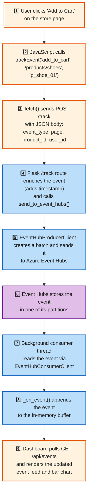

# CST8916 Assignment 2

## Architecture

```mermaid
flowchart LR
    subgraph AAS["☁️ Azure App Service"]
        direction TB
        Store["🛍️ client.html\nDemo Store\n(Event Producer)"]
        Dashboard["📊 dashboard.html\nLive Dashboard\n(Event Consumer View)"]

        subgraph Flask["⚙️ app.py — Flask Application"]
            direction TB
            Track["/track\nsend_to_event_hubs()"]
            API["/api/events\n_event_buffer"]
            APIInsights["/api/insights\n_device_event_buffer + _traffic_event_buffer"]
            ConsumerClick["Consumer: clickstream\nEventHubConsumerClient"]
            ConsumerInsights["Consumers: device + traffic\nEventHubConsumerClient"]
        end

        Store -->|"POST /track"| Track
        API -->|"JSON response"| Dashboard
        APIInsights -->|"JSON response"| Dashboard
        Dashboard -->|"polls every 2 s\nGET /api/events"| API
        Dashboard -->|"polls every 2 s\nGET /api/insights"| APIInsights
    end

    subgraph EH["☁️ Azure Event Hubs"]
        direction TB
        NS["Namespace: shopstream"]
        Hub["Event Hub: clickstream"]
        HubDevice["Event Hub: stream-analytics-results"]
        HubTraffic["Event Hub: stream-analytics-spikes"]
        P0["Partition 0"]
        P1["Partition 1"]
        NS --> Hub
        NS --> HubDevice
        NS --> HubTraffic
        Hub --> P0
        Hub --> P1
    end

    subgraph ASA["☁️ Azure Stream Analytics"]
        direction TB
        SAJob["Job: device + spike analytics"]
    end

    Track -->|"azure-eventhub SDK\npublish click events"| Hub
    Hub -->|"input stream"| SAJob
    SAJob -->|"output: device windows"| HubDevice
    SAJob -->|"output: traffic windows"| HubTraffic
    Hub -->|"read clickstream\ncontinuously"| ConsumerClick
    HubDevice -->|"read device events"| ConsumerInsights
    HubTraffic -->|"read traffic events"| ConsumerInsights
    ConsumerClick -->|"append to buffer"| API
    ConsumerInsights -->|"append to buffers"| APIInsights

    %% ── Colour palette ──────────────────────────────────────────────
    %% Frontend (warm amber)
    style Store     fill:#FFF3E0,stroke:#E65100,color:#212121,stroke-width:2px
    style Dashboard fill:#FFF3E0,stroke:#E65100,color:#212121,stroke-width:2px

    %% Flask internals (cool blue)
    style Flask     fill:#E3F2FD,stroke:#1565C0,color:#212121,stroke-width:2px
    style Track     fill:#BBDEFB,stroke:#1565C0,color:#212121,stroke-width:1.5px
    style API       fill:#BBDEFB,stroke:#1565C0,color:#212121,stroke-width:1.5px
    style APIInsights fill:#BBDEFB,stroke:#1565C0,color:#212121,stroke-width:1.5px
    style ConsumerClick fill:#BBDEFB,stroke:#1565C0,color:#212121,stroke-width:1.5px
    style ConsumerInsights fill:#BBDEFB,stroke:#1565C0,color:#212121,stroke-width:1.5px

    %% App Service container (light grey)
    style AAS       fill:#F5F5F5,stroke:#616161,color:#212121,stroke-width:2px

    %% Event Hubs (purple / Microsoft brand)
    style EH        fill:#F3E5F5,stroke:#6A1B9A,color:#212121,stroke-width:2px
    style NS        fill:#E1BEE7,stroke:#6A1B9A,color:#212121,stroke-width:1.5px
    style Hub       fill:#CE93D8,stroke:#6A1B9A,color:#212121,stroke-width:1.5px
    style HubDevice fill:#CE93D8,stroke:#6A1B9A,color:#212121,stroke-width:1.5px
    style HubTraffic fill:#CE93D8,stroke:#6A1B9A,color:#212121,stroke-width:1.5px
    style P0        fill:#BA68C8,stroke:#6A1B9A,color:#FFFFFF,stroke-width:1.5px
    style P1        fill:#BA68C8,stroke:#6A1B9A,color:#FFFFFF,stroke-width:1.5px

    %% Stream Analytics (teal)
    style ASA       fill:#E0F2F1,stroke:#00695C,color:#212121,stroke-width:2px
    style SAJob     fill:#B2DFDB,stroke:#00695C,color:#212121,stroke-width:1.5px
```



---

## Prerequisites

- Python 3.x and pip installed
- An **Azure account** (free tier is fine)
- **Azure CLI** installed — [install guide](https://learn.microsoft.com/en-us/cli/azure/install-azure-cli)
- VS Code with the **REST Client** extension (optional)

---

## Part 1: Create the Azure Event Hubs Namespace

An **Event Hubs Namespace** is a container that holds one or more Event Hubs (similar to how a database server holds multiple databases).

### Step 1 – Log in to the Azure Portal

Go to [portal.azure.com](https://portal.azure.com) and sign in.

### Step 2 – Create a Resource Group

1. Search for **Resource groups** in the top search bar.
2. Click **Create**.
3. Fill in:
   - **Subscription:** your subscription
   - **Resource group name:** `cst8916-week10-rg`
   - **Region:** `Canada Central`
4. Click **Review + create** → **Create**.

### Step 3 – Create an Event Hubs Namespace

1. Search for **Event Hubs** in the top search bar.
2. Click **Create**.
3. Fill in:
   - **Subscription:** your subscription
   - **Resource group:** `cst8916-week10-rg`
   - **Namespace name:** `shopstream-<your-name>` (must be globally unique)
   - **Region:** `Canada Central`
   - **Pricing tier:** `Basic`
4. Click **Review + create** → **Create**.
5. Wait for deployment to complete, then click **Go to resource**.

### Step 4 – Create an Event Hub inside the Namespace

1. Inside your namespace, click **+ Event Hub** in the top toolbar.
2. Fill in:
   - **Name:** `clickstream`
   - **Partition count:** `2`
   - **Message retention:** `1` day
3. Click **Create**.

```
Event Hubs Namespace: shopstream-<your-name>
└── Event Hub: clickstream
    ├── Partition 0  ← some events land here
    └── Partition 1  ← other events land here
```

### Step 5 – Copy the Connection String

1. In the namespace, go to **Shared access policies** (left menu).
2. Click **RootManageSharedAccessKey**.
3. Copy the **Primary connection string** — you will need it in Part 2.

> **Security note:** A connection string contains a secret key. Never commit it to Git. You will store it as an environment variable.

---

## Part 2: Run the App Locally

### Step 1 – Clone and install

```bash
git clone https://github.com/YOUR-USERNAME/26W_CST8916_Week10-Event-Hubs-Lab.git
cd 26W_CST8916_Week10-Event-Hubs-Lab
pip install -r requirements.txt
```

### Step 2 – Set environment variables

**Linux / macOS:**
```bash
export EVENT_HUB_CONNECTION_STR="Endpoint=sb://shopstream-<your-name>.servicebus.windows.net/;SharedAccessKeyName=RootManageSharedAccessKey;SharedAccessKey=<your-key>"
export EVENT_HUB_NAME="clickstream"
```

**Windows (PowerShell):**
```powershell
$env:EVENT_HUB_CONNECTION_STR="Endpoint=sb://shopstream-<your-name>.servicebus.windows.net/;SharedAccessKeyName=RootManageSharedAccessKey;SharedAccessKey=<your-key>"
$env:EVENT_HUB_NAME="clickstream"
```

> Never put your connection string directly in the code. The app reads it from the environment so secrets stay out of source control.

### Step 3 – Run the app

```bash
python app.py
```

You should see:
```
Event Hubs consumer thread started
 * Running on http://0.0.0.0:8000
```

### Step 4 – Try it out

1. Open `http://localhost:8000` — the ShopStream store loads.
2. Click on products, add items to cart, click the banner.
3. Watch the **Event Stream Log** at the bottom of the store page — each click shows as `→ sent to Event Hubs`.
4. Open `http://localhost:8000/dashboard` — the live dashboard updates every 2 seconds.

---

## Part 3: Understanding the Code

### How an event travels from click to Event Hubs



### Key SDK classes (from `azure-eventhub`)

| Class | Role |
|-------|------|
| `EventHubProducerClient` | Sends events to Event Hubs |
| `EventHubConsumerClient` | Reads events from Event Hubs |
| `EventData` | Wraps a single event payload (bytes or string) |
| `create_batch()` | Groups multiple events into one efficient send operation |

### Event payload structure

```json
{
  "event_type": "add_to_cart",
  "page": "/products/shoes",
  "product_id": "p_shoe_01",
  "user_id": "u_4a2f",
  "session_id": "s_9b3e",
  "timestamp": "2026-03-18T14:22:05.123456+00:00"
}
```

---

## Part 4: Deploy to Azure App Service

You will deploy the app directly from your GitHub fork using Azure App Service's built-in GitHub integration — no CLI required.

### Step 1 – Create the Web App in the portal

1. Go to [portal.azure.com](https://portal.azure.com) and sign in.
2. In the top search bar, search for **App Services** and click it.
3. Click **+ Create** → **Web App**.
4. Fill in the **Basics** tab:

| Field | Value |
|-------|-------|
| **Subscription** | your subscription |
| **Resource group** | `cst8916-week10-rg` (same one from Part 1) |
| **Name** | `shopstream-<your-name>` (must be globally unique) |
| **Publish** | Code |
| **Runtime stack** | Python 3.11 |
| **Operating System** | Linux |
| **Region** | Canada Central |
| **Pricing plan** | Basic |

5. Click **Next: Deployment →**.

### Step 4 – Connect your GitHub fork

On the **Deployment** tab:

1. Set **Continuous deployment** to **Enable**.
2. Under **GitHub Actions settings**, click **Authorize** and sign in to GitHub when prompted.
3. Fill in:
   - **Organization:** your GitHub username
   - **Repository:** `26W_CST8916_Week10-Event-Hubs-Lab`
   - **Branch:** `main`
4. Click **Review + create** → **Create**.

### Step 5 – Set Application Settings (environment variables)

The app reads the Event Hubs connection string from environment variables. You set these in the portal so the secret never lives in your code or repository.

1. Go to your App Service → **Environment variables** in the left menu (under **Settings**).
2. Under the **App settings** tab, click **+ Add** and add each of the following:

| Name | Value |
|------|-------|
| `EVENT_HUB_CONNECTION_STR` | your connection string from Part 1, Step 5 |
| `EVENT_HUB_NAME` | `clickstream` |
| `DEVICE_EVENT_HUB_NAME` | `stream-analytics-results` |
| `TRAFFIC_EVENT_HUB_NAME` | `stream-analytics-spikes` |
| `TRAFFIC_SPIKE_THRESHOLD` | `20` (optional; set your own spike threshold) |

3. Click **Apply** → **Confirm**.

### Step 6 – Set the startup command

Azure App Service needs to know how to start the Flask app using Gunicorn (the production web server).

1. In your App Service, click **Configuration** → **Stack settings** tab.
2. In the **Startup command** field, enter:
   ```
   gunicorn --bind 0.0.0.0:8000 app:app
   ```
3. Click **Apply**.

### Step 7 – Verify the deployment

1. Go to your repository on GitHub → **Actions** tab.
2. You should see a workflow run in progress or completed. Click it to watch the build logs.
3. Once the workflow shows a green checkmark, go back to the Azure Portal.
4. In your App Service, click **Overview** → find the **Default domain** and click it.
5. The ShopStream store should load. Click around, then open `/dashboard` to see the live analytics.

---